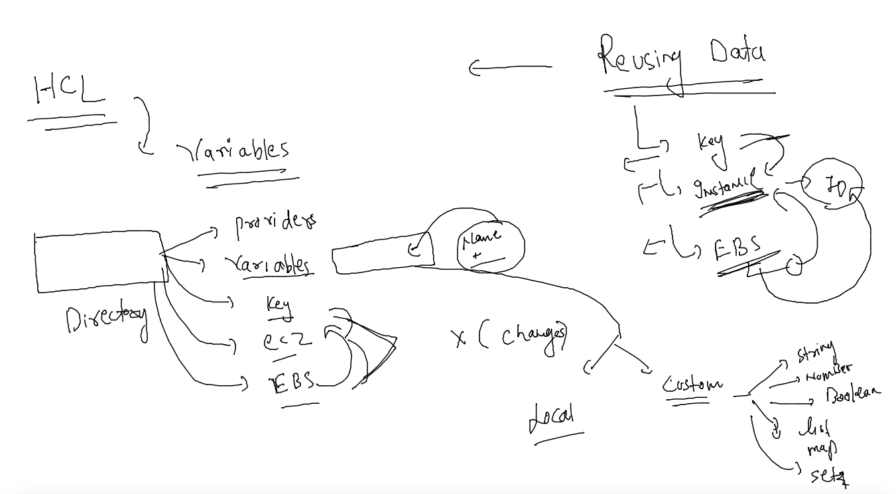

# terraform-11thjuly2022

### Understanding vairables in HCL -- for Terraform best practise 



### using variables of string type 

#### variables.tf

```
variable "ami_id" {
    type = string
    description = "here we are keeping ami-id to create ec2-instance"
    default = "ami-098e42ae54c764c35"
  
}

variable "instance_type" {
    type = string
    description = "type of ec2 resources "
    default = "t2.micro"
  
}

variable "my_key" {
    type = string
    description = "my personal private key for ec2"
    default = "helloashu"
  
}
```

### creating ec2 using variables

```
resource "aws_instance" "ashuvm2" {

    ami = var.ami_id
    instance_type = var.instance_type
    tags = {
      "Name" = "ashuvmby-tf"
    }
    key_name = var.my_key
  
}
```

### lets deploy it 

```
1125  terraform init 
 1126  ls -a
 1127  terraform plan 
 1128  terraform apply --auto-approve 
```

### checking output 

```
output "details-required" {
    value = "${aws_instance.ashuvm2.public_ip} and id ${aws_instance.ashuvm2.id}"
  
}
```
### apply it again 

```
fire@ashutoshhs-MacBook-Air tf_best % terraform apply --auto-approve           
aws_instance.ashuvm2: Refreshing state... [id=i-0d949c715ea9ad4a5]

No changes. Your infrastructure matches the configuration.

Terraform has compared your real infrastructure against your configuration and found no differences, so
no changes are needed.

Apply complete! Resources: 0 added, 0 changed, 0 destroyed.

Outputs:

details-required = "54.149.38.212 and id i-0d949c715ea9ad4a5"
fire@ashutoshhs-MacBook-Air tf_best % 
```


