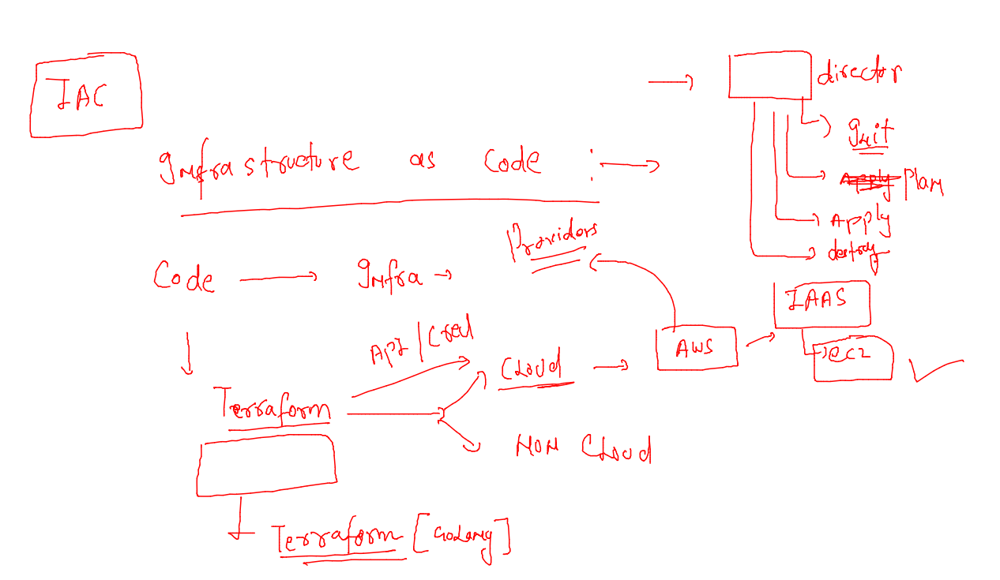

# terraform-11thjuly2022

### day1 revision 




### creating keypair in ec2 service 


### keygen method 

```
# resource for choose algo method 
resource "tls_private_key" "ashusecret" {
    algorithm = "RSA"
    rsa_bits = 4096 
  
}

resource "aws_key_pair" "ashugen_key" {
    key_name = "ashu_private_key"
    public_key = tls_private_key.ashusecret.public_key_openssh
    # above method will store public key in cloud env 
    provisioner "local-exec" {
        command = "echo '$tls_private_key.ashusecret.private_key_pem' >./ashu.pem"
      
    }
  
}

```


