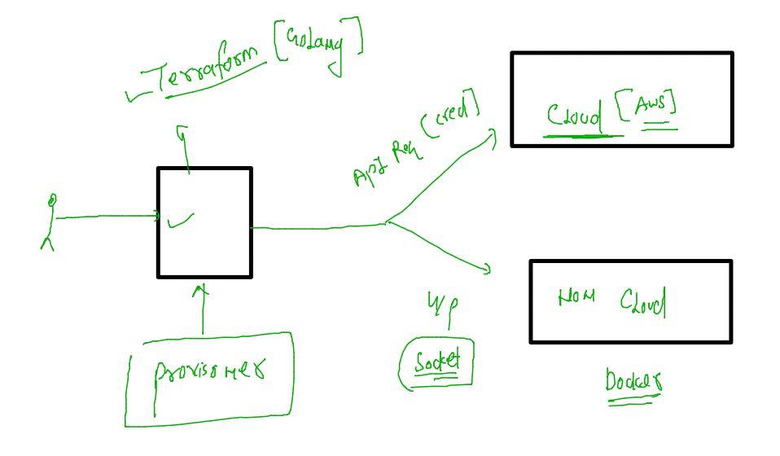

# terraform-11thjuly2022

### Intro about terraform 


### terraform connections 



### install terraform in provisoner system 

[download_link](https://www.terraform.io/downloads)

### checking version 

```
root@ashutoshhs-MacBook-Air Desktop # 
fire@ashutoshhs-MacBook-Air Desktop % terraform -v
Terraform v1.2.4
on darwin_amd64
fire@ashutoshhs-MacBook-Air Desktop % /usr/local/bin/terraform -v
Terraform v1.2.4
on darwin_amd64
fire@ashutoshhs-MacBook-Air Desktop % 

```

### how terraform script look like 


### understanding resources of terraform 


### first terraform code 

```
provider "aws" {

    access_key = ""
    secret_key = "I"
    region = "" # this aws oregon region 
   
}

#        resource name   ref name 
resource "aws_instance" "ashuvm1" {

    ami = "ami-098e42ae54c764c35"
    instance_type = "t2.micro"
    tags = {
      "Name" = "ashulinuxvm-tf"
    }
    key_name = "ashukey"
  
}


```

## lets run the code 

### init (oneTime job)

```
fire@ashutoshhs-MacBook-Air terraform_code % 
fire@ashutoshhs-MacBook-Air terraform_code % ls
ec2_create.tf
fire@ashutoshhs-MacBook-Air terraform_code % terraform init 

Initializing the backend...

Initializing provider plugins...
- Finding latest version of hashicorp/aws...
- Installing hashicorp/aws v4.22.0...
- Installed hashicorp/aws v4.22.0 (signed by HashiCorp)

Terraform has created a lock file .terraform.lock.hcl to record the provider
selections it made above. Include this file in your version control repository
so that Terraform can guarantee to make the same selections by default when
you run "terraform init" in the future.

Terraform has been successfully initialized!

You may now begin working with Terraform. Try running "terraform plan" to see
any changes that are required for your infrastructure. All Terraform commands
should now work.

If you ever set or change modules or backend configuration for Terraform,
rerun this command to reinitialize your working directory. If you forget, other
commands will detect it and remind you to do so if necessary.
```


### plan --dry-run 

```
fire@ashutoshhs-MacBook-Air terraform_code % terraform plan 

Terraform used the selected providers to generate the following execution plan. Resource actions are indicated with the
following symbols:
  + create

Terraform will perform the following actions:

  # aws_instance.ashuvm1 will be created
  + resource "aws_instance" "ashuvm1" {
      + ami                                  = "ami-098e42ae54c764c35"
      + arn                                  = (known after apply)
      + associate_public_ip_address          = (known after apply)
      + availability_zone                    = (known after apply)
      + cpu_core_count                       = (known after apply)
      + cpu_threads_per_core                 = (known after apply)
      + disable_api_stop                     = (known after apply)
      + disable_api_termination              = (known after apply)
```

### apply 

```
fire@ashutoshhs-MacBook-Air terraform_code % terraform apply

Terraform used the selected providers to generate the following execution plan. Resource actions are indicated with the
following symbols:
  + create

Terraform will perform the following actions:

  # aws_instance.ashuvm1 will be created
  + resource "aws_instance" "ashuvm1" {
      + ami                                  = "ami-098e42ae54c764c35"
      + arn                                  = (known after apply)
      + associate_public_ip_address          = (known after apply)
      + availability_zone                    = (known after apply)
      + cpu_core_count                       = (known after apply)
      + cpu_threads_per_core                 = (known after apply)
      + disable_api_stop                     = (known after apply)
      + disable_api_termination              = (known after apply)
      + ebs_optimized                        = (known after apply)
      + get_password_data                    = false
      + host_id                              = (known after apply)
      + id                                   = (known after apply)
      + instance_initiated_shutdown_behavior = (known after apply)
      + instance_state                       = (known after apply)
      + instance_type                        = "t2.micro"
      + ipv6_address_count                   = (known after apply)
      + ipv6_addresses                       = (known after apply)
      + key_name                             = "ashukey"
      + monitoring                           = (known after apply)
      + outpost_arn                          = (known after apply)
      + password_data                        = (known after apply)
      + placement_group                      = (known after apply)
      + placement_partition_number           = (known after apply)
      + primary_network_interface_id         = (known after apply)
      + private_dns                          = (known after apply)
      + private_ip                           = (known after apply)
      + public_dns                           = (known after apply)
      + public_ip                            = (known after apply)
      + secondary_private_ips                = (known after apply)
      + security_groups                      = (known after apply)
      + source_dest_check                    = true
      + subnet_id                            = (known after apply)
      + tags                                 = {
          + "Name" = "ashulinuxvm-tf"
        }
      + tags_all                             = {
          + "Name" = "ashulinuxvm-tf"
        }
      + tenancy                              = (known after apply)
      + user_data                            = (known after apply)
      + user_data_base64                     = (known after apply)
      + user_data_replace_on_change          = false
      + vpc_security_group_ids               = (known after apply)

      + capacity_reservation_specification {
          + capacity_reservation_preference = (known after apply)

          + capacity_reservation_target {
              + capacity_reservation_id                 = (known after apply)
              + capacity_reservation_resource_group_arn = (known after apply)
            }
        }

      + ebs_block_device {
          + delete_on_termination = (known after apply)
          + device_name           = (known after apply)
          + encrypted             = (known after apply)
          + iops                  = (known after apply)
          + kms_key_id            = (known after apply)
          + snapshot_id           = (known after apply)
          + tags                  = (known after apply)
          + throughput            = (known after apply)
          + volume_id             = (known after apply)
          + volume_size           = (known after apply)
          + volume_type           = (known after apply)
        }

      + enclave_options {
          + enabled = (known after apply)
        }

      + ephemeral_block_device {
          + device_name  = (known after apply)
          + no_device    = (known after apply)
          + virtual_name = (known after apply)
        }

      + maintenance_options {
          + auto_recovery = (known after apply)
        }

      + metadata_options {
          + http_endpoint               = (known after apply)
          + http_put_response_hop_limit = (known after apply)
          + http_tokens                 = (known after apply)
          + instance_metadata_tags      = (known after apply)
        }

      + network_interface {
          + delete_on_termination = (known after apply)
          + device_index          = (known after apply)
          + network_card_index    = (known after apply)
          + network_interface_id  = (known after apply)
        }

      + private_dns_name_options {
          + enable_resource_name_dns_a_record    = (known after apply)
          + enable_resource_name_dns_aaaa_record = (known after apply)
          + hostname_type                        = (known after apply)
        }

      + root_block_device {
          + delete_on_termination = (known after apply)
          + device_name           = (known after apply)
          + encrypted             = (known after apply)
          + iops                  = (known after apply)
          + kms_key_id            = (known after apply)
          + tags                  = (known after apply)
          + throughput            = (known after apply)
          + volume_id             = (known after apply)
          + volume_size           = (known after apply)
          + volume_type           = (known after apply)
        }
    }

Plan: 1 to add, 0 to change, 0 to destroy.

Do you want to perform these actions?
  Terraform will perform the actions described above.
  Only 'yes' will be accepted to approve.

  Enter a value: yes
  Do you want to perform these actions?
  Terraform will perform the actions described above.
  Only 'yes' will be accepted to approve.

  Enter a value: yes

aws_instance.ashuvm1: Creating...
aws_instance.ashuvm1: Still creating... [10s elapsed]
aws_instance.ashuvm1: Still creating... [20s elapsed]
aws_instance.ashuvm1: Still creating... [30s elapsed]
aws_instance.ashuvm1: Still creating... [40s elapsed]
aws_instance.ashuvm1: Creation complete after 47s [id=i-0720734abc6933852]

Apply complete! Resources: 1 added, 0 changed, 0 destroyed.
```


### 


